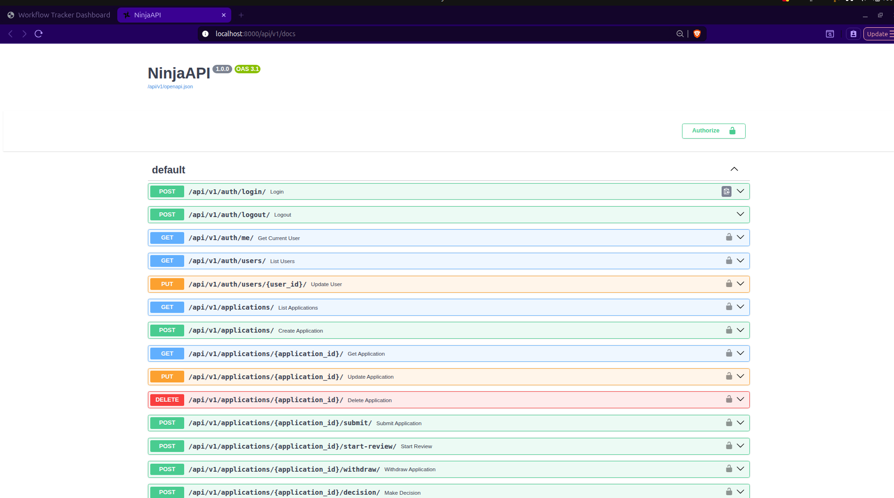
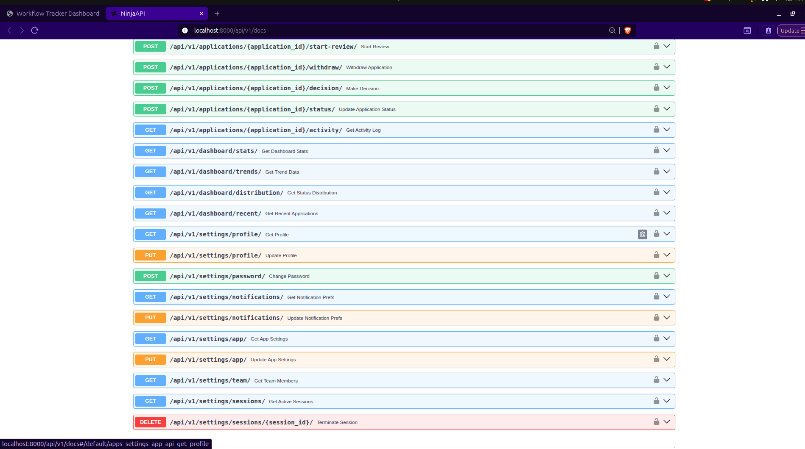
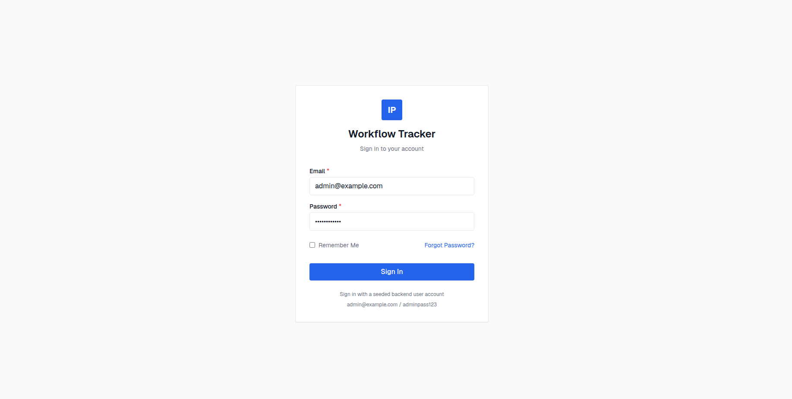
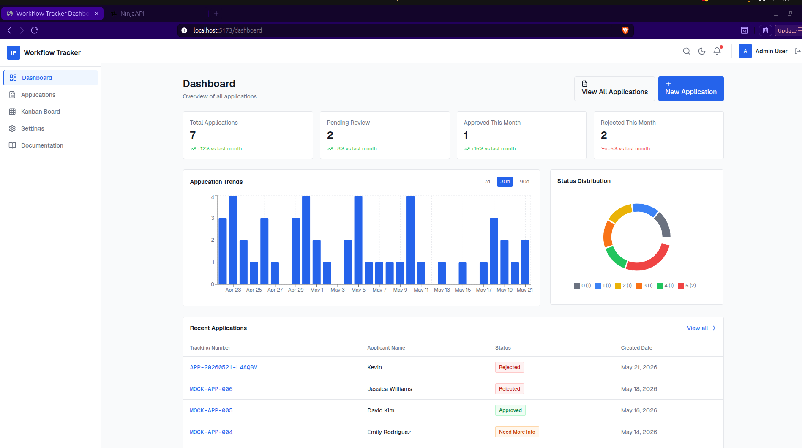
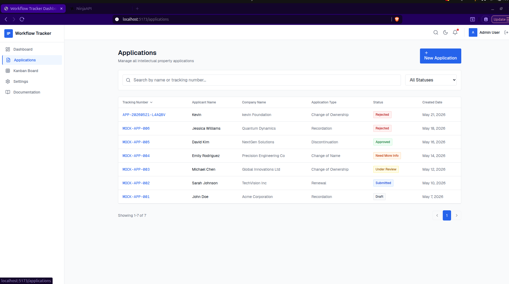
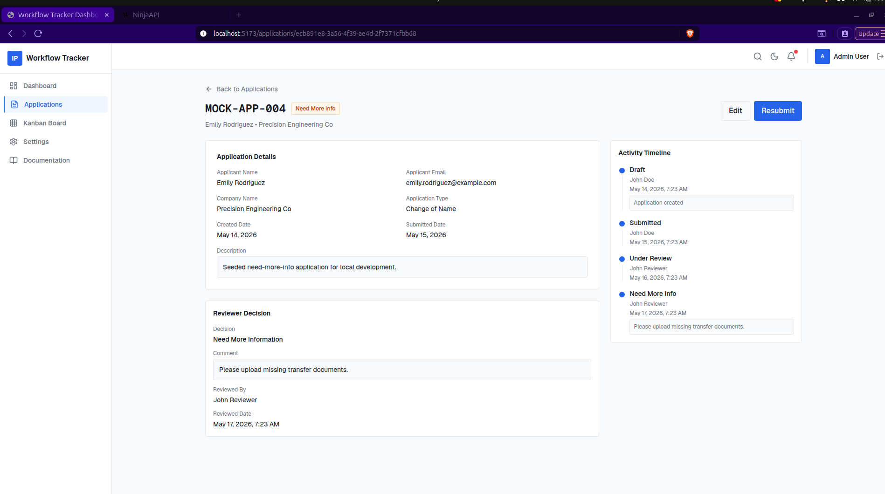
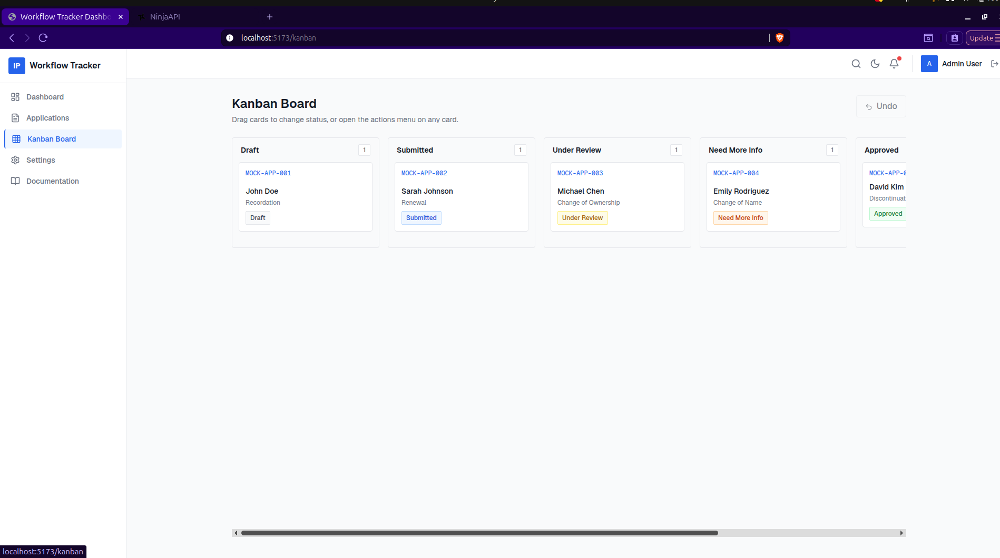
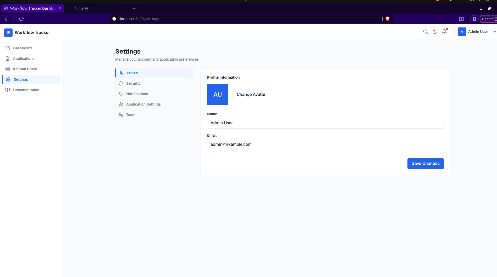

# IP Workflow Tracker

A complete full-stack application for managing Intellectual Property workflows featuring a Django + Django Ninja backend and React + Vite frontend.
# Author 
Name: Titus Kiplagat
Email: tituskiplagat06@gmail.com
Github: https://github.com/Titus210

## 🚀 Quick Start

### Prerequisites
- Python 3.8+
- Node.js 18+ (Recommended: Node.js 20.x)
- npm 9+ or yarn 1.22+
- Git
- Docker and Docker Compose (for containerized deployment)

### Backend Setup (Local Development)
```bash
cd backend
python -m venv venv
source venv/bin/activate  # On Windows: venv\Scripts\activate
pip install -r requirements.txt

# Create .env file (copy from backend/README.md for details)
python manage.py makemigrations
python manage.py migrate
python manage.py createsuperuser
python manage.py runserver 0.0.0.0:8000
```

### Frontend Setup (Local Development)
```bash
cd ../frontend
npm install
# Ensure .env exists with: VITE_API_URL=http://localhost:8000/api/v1
npm run dev
```

### Access the Application (Local Development)
- **Frontend**: http://localhost:5173/
- **Backend API**: http://localhost:8000/api/v1/
- **API Docs**: http://localhost:8000/api/v1/docs
- **Admin Panel**: http://localhost:8000/admin/

### Docker Deployment
```bash
cd deployment
docker compose up --build
```
The application will be available at:
- **Frontend**: http://localhost:5173/
- **Backend API**: http://localhost:8000/api/v1/
- **API Docs**: http://localhost:8000/api/v1/docs
- **Admin Panel**: http://localhost:8000/admin/

To stop the Docker deployment:
```bash
docker compose down
```

## 📚 Documentation

For detailed information, please refer to:
- **[Backend Documentation](backend/README.md)** - Complete API reference, setup instructions, features, and technology stack
- **[Frontend Documentation](frontend/README.md)** - User guide, development practices, features, and technology stack
- **This Document** - Project overview and quick start instructions

## 📸 Screenshots


### Backend 
- API documentation (Ninja API) showing endpoints
- Django admin interface showing models
- Example of successful API responses


### Frontend Pages
- Login page

- Dashboard with statistics and charts

- Application list and detail views


- Kanban board showing workflow states

- Settings management pages


### Deployment
- Docker containers running
- Database schema diagrams
- Architecture overview

## 🏗️ Project Structure

```
workflow/
├── backend/                 # Django + Django Ninja API
│   ├── manage.py
│   ├── requirements.txt
│   ├── .env
│   ├── config/              # Django settings
│   └── apps/                # Django applications
├── frontend/                # React + Vite SPA
│   ├── src/
│   │   ├── api/             # API service clients
│   │   ├── components/      # Reusable UI components
│   │   ├── pages/           # Page components
│   │   └── App.tsx
│   ├── .env                 # Frontend environment variables
│   ├── package.json
│   ├── vite.config.ts
├── deployment/              # Docker deployment files
│   ├── backend.Dockerfile
│   ├── frontend.Dockerfile
│   └── docker-compose.yml
└── README.md                # This file
```

## ✨ Features

### Backend Features
- **Authentication**: JWT-based login/logout with role-based access (Admin, Reviewer, Applicant)
- **Application Management**: Full CRUD operations with workflow state machine
- **Workflow Engine**: 
  - DRAFT → SUBMITTED → UNDER_REVIEW → {APPROVED, REJECTED, NEED_MORE_INFO}
  - SUBMITTED → DRAFT (withdraw)
  - NEED_MORE_INFO → SUBMITTED (resubmit)
- **Activity Logging**: Complete audit trail of all status changes
- **Dashboard**: Statistics, trends (7d/30d/90d), distribution, recent applications
- **Settings**: Profile, password, notifications, app settings, team, sessions
- **Role-Based Access Control**: Fine-grained permissions for different user roles
- **Database Indexes**: Optimized for common queries (tracking_number, status, created_at, applicant_email)
- **API Documentation**: Auto-generated Swagger UI and OpenAPI specification
- **Testing**: Comprehensive test suite (35/35 tests passing)

### Frontend Features
- **Modern Stack**: React 18, Vite, TypeScript, Tailwind CSS 3.4
- **Authentication**: Secure login/logout with JWT handling
- **Application Workflow**: Create, view, edit, delete IP applications
- **Kanban Board**: Intuitive drag-and-drop interface for workflow management
- **Dashboard**: Analytics, statistics, trends, and distribution charts
- **Settings**: User profile management, notification preferences, application settings
- **Real-time Updates**: Communicates with backend API via centralized apiClient
- **Responsive Design**: Mobile-friendly interface
- **Notifications**: Toast notifications for user feedback
- **Keyboard Shortcuts**: Enhanced productivity with keyboard navigation
- **Theme Support**: Dark/Light mode switching
- **Error Handling**: Graceful error display and recovery mechanisms
- **Loading States**: Skeletons and spinners for better UX

## 🧪 Testing

### Backend Tests
```bash
cd backend
export DJANGO_SETTINGS_MODULE=config.settings
python -m pytest tests/ -v
```
All 35 backend tests pass, covering:
- Authentication endpoints
- Application CRUD operations
- Workflow state machine transitions
- Role-based access control
- Dashboard statistics and analytics
- Settings management
- Error handling and validation

### Frontend Testing
Consider adding:
- Unit tests with Vitest/Jest
- Integration tests with Cypress/Playwright
- Visual regression testing

## 🔧 Troubleshooting

### Common Issues

1. **Port Already in Use (8000 or 5173)**
   ```bash
   # Find and kill process
   lsof -ti:8000 | xargs kill -9
   lsof -ti:5173 | xargs kill -9
   ```

2. **Database Migration Issues**
   ```bash
   # Reset database (development only)
   rm db.sqlite3
   python manage.py makemigrations
   python manage.py migrate
   ```

3. **CORS Issues**
   - Ensure `CORS_ALLOWED_ORIGINS` in backend settings includes frontend URL
   - Default includes http://localhost:5173 and http://127.0.0.1:5173

4. **Authentication Problems**
   - Clear browser localStorage and cookies
   - Verify JWT token expiration (1 hour default)
   - Check backend logs for detailed error messages

5. **Frontend Build Issues**
   ```bash
   cd frontend
   rm -rf node_modules package-lock.json
   npm install
   ```

6. **Docker Issues**
   - Ensure Docker and Docker Compose are installed and running
   - For permission issues, try running Docker commands with sudo (Linux) or adjust Docker daemon settings
   - To rebuild images: `docker compose build --no-cache`

## 📖 API Documentation

Once both servers are running:
- **Backend Swagger UI**: `http://localhost:8000/api/v1/docs`
- **Backend OpenAPI JSON**: `http://localhost:8000/api/v1/openapi.json`
- **Backend Admin**: `http://localhost:8000/admin/`

## 🤝 Contributing

1. Fork the repository
2. Create your feature branch (`git checkout -b feature/amazing-feature`)
3. Commit your changes (`git commit -m 'Add some amazing feature'`)
4. Push to the branch (`git push origin feature/amazing-feature`)
5. Open a Pull Request

## 📄 License

This project is licensed under the MIT License - see the LICENSE file for details.

## 🙏 Acknowledgments

- Built with Django, Django Ninja, React, Vite, TypeScript, and Tailwind CSS
- Icons provided by Lucide
- Charts powered by Recharts
- Animations by Framer Motion
- Drag and drop by @dnd-kit
- Notifications by Sonner
- Inspired by modern IP management systems